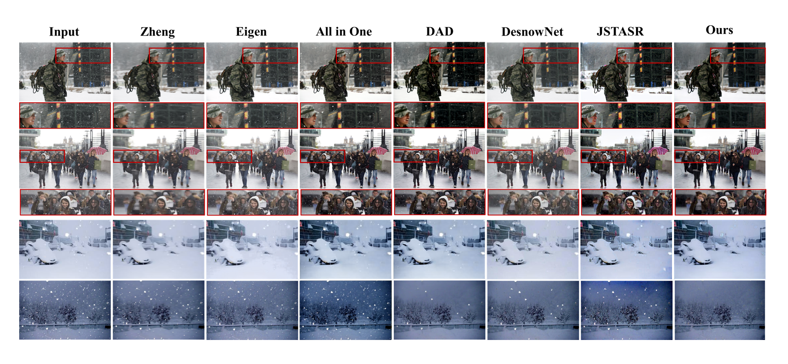

# ALL Snow Removed: Single Image Desnowing Algorithm Using Hierarchical Dual-tree Complex Wavelet Representation and Contradict Channel Loss (HDCWNet)

### Accepted by ICCV 2021.




# Abstract:
Snow is a highly complicated atmospheric phenomenon that usually contains snowflake, snow streak, and veiling effect (similar to the haze or the mist). In this literature, we propose a single image desnowing algorithm to address the diversity of snow particles in shape and size. First, to better represent the complex snow shape, we apply the dual-tree wavelet transform and propose a complex wavelet loss in the network. Second, we propose a hierarchical decomposition paradigm in our network for better understanding the different sizes of snow particles. Last, we propose a novel feature called the contradict channel (CC) for the snow scenes. We find that the regions containing the snow particles tend to have higher intensity in the CC than that in the snow-free regions. We leverage this discriminative feature to construct the contradict channel loss for improving the performance of snow removal. Moreover, due to the limitation of existing snow datasets, to simulate the snow scenarios comprehensively, we propose a large-scale dataset called Comprehensive Snow Dataset (CSD). Experimental results show that the proposed method can favorably outperform existing methods in three synthetic datasets and real-world datasets.


[[Paper Download]](https://openaccess.thecvf.com/content/ICCV2021/papers/Chen_ALL_Snow_Removed_Single_Image_Desnowing_Algorithm_Using_Hierarchical_Dual-Tree_ICCV_2021_paper.pdf)
[[Dataset Download]](https://ccncuedutw-my.sharepoint.com/:u:/g/personal/104501531_cc_ncu_edu_tw/EfCooq0sZxxNkB7F8HgCyKwB-sJQtVE59_Gpb9soatYi5A?e=5NjDhb)
[[Poster Download]](https://ntucc365-my.sharepoint.com/:b:/g/personal/f05943089_ntu_edu_tw/EXjU8U85nMZMkoHwqVCO_QEBlWvz9U803iinqfkLv3QrZg?e=3k0diD)
[[Slide Download]](https://ntucc365-my.sharepoint.com/:b:/g/personal/f05943089_ntu_edu_tw/EVUaKr-l1UNDoUeuInao0RkB6kv5MDMfUcUCNp96rRZeTA?e=5LYZSC)

You can also refer our previous work on other low-level vision applications!

Desnowing-[[JSTASR]](https://github.com/weitingchen83/JSTASR-DesnowNet-ECCV-2020)\\
Dehazing-[[PMS-Net]](https://github.com/weitingchen83/PMS-Net) and [[PMHLD]](https://github.com/weitingchen83/Dehazing-PMHLD-Patch-Map-Based-Hybrid-Learning-DehazeNet-for-Single-Image-Haze-Removal-TIP-2020)\\
Image Relighting-[[MB-Net]](https://github.com/weitingchen83/NTIRE2021-Depth-Guided-Image-Relighting-MBNet) and [[S3Net]](https://github.com/dectrfov/NTIRE-2021-Depth-Guided-Image-Any-to-Any-relighting)


# Dataset
We also propose a large scale dataset called Comprehensive Snow Dataset (CSD). It can present the snow scenes in more comprehensive way. You can leverage this dataset to train your network.


# Setup and environment

To generate the recovered result you need:

1. Python 3
2. CPU or NVIDIA GPU + CUDA CuDNN
3. tensorflow 1.15.0
4. keras 2.3.0
5. dtcwt 0.12.0

Testing
```
$ python ./predict.py -dataroot ./your_dataroot -datatype datatype -predictpath ./output_path -batch_size batchsize
```
*datatype default: tif, jpg ,png

Examples
```
$ 
python ./predict.py -dataroot ./testImg -predictpath ./p -batch_size 3
python ./predict.py -dataroot ./testImg -datatype tif -predictpath ./p -batch_size 3
```


The pre-trained model can be downloaded from: https://ntucc365-my.sharepoint.com/:u:/g/personal/f05943089_ntu_edu_tw/EZtus9ex-GtNukLuSxWGmPIBEJIzRFMbEl0dFeZ_oTQnVQ?e=xnfqFL. 
Put the "finalmodel.h5" to the 'modelParam'.


# Citations
Please cite this paper in your publications if it is helpful for your tasks:    

Bibtex:
```
@inproceedings{chen2021all,
    title     = {ALL Snow Removed: Single Image Desnowing Algorithm Using HierarchicalDual-tree Complex Wavelet Representation and Contradict Channel Loss},
    author    = {Chen, Wei-Ting and Fang, Hao-Yu, and Hsieh, Cheng-Lin, and Tsai, Cheng-Che, and Chen, I-Hsiang, and Ding, Jian-Jiun, and Kuo, Sy-Yen},
    booktitle = {Proceedings of the IEEE/CVF International Conference on Computer Vision (ICCV)},
    year      = {2021}
}
```
